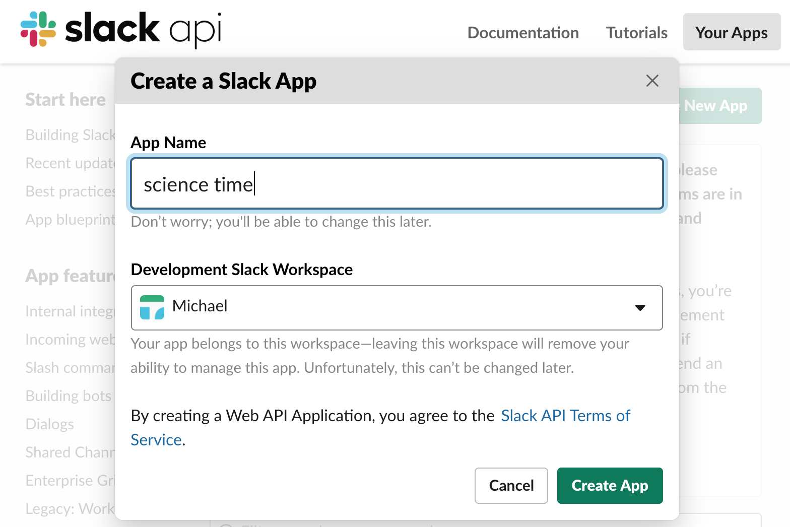

labmanageR
==========

Slacking you the latest and greatest changes from your Open Science Framework projects.


Installing
------------

```R
# Also be sure to install these packages
remotes::install_github("CenterForOpenScience/osfr")
remotes::install_github("hrbrmstr/slackr")


# install labmanageR from github
remotes::install_github("machow/labmanageR")

```

Check for a user's OSF updates
--------------------------------

The code below will print out a table of changes made after January 1st.
(The user ID being used here is mine :).

```R
library(labmanageR)

osf_report_modified("aswnc", after_date = "2019-01-01")
```


Slackbot
--------

For posting changes to slack, you can use the `osf_report_modified_slack` command with the same options.
You'll also need to set up an incoming webhook on slack, so that the slackr package knows where to send your updates.

See

* [slack docs on incoming webhooks](https://api.slack.com/incoming-webhooks)
* [slackr setup docs](https://github.com/hrbrmstr/slackr#setup)


```R
osf_report_modified_slack("aswnc", after_date = "2019-01-01", type = "user")
```

### Getting your slack webhook

First, go to https://api.slack.com/apps, and click "Create New App" (shown below).


Next, enter the name of your bot, and the slack workspace it will belong to.



Finally, in the "Add Features and Functionality" section of the main page should be a "Incoming Webhooks" option.
Click it, and toggle the botton from off to on. Then, scroll down to the bottom of the page and click "Add New Webhook to Workspace". (Shown below).


You should now be able to copy your webhook link. Put it into a file named `~/.slackrc`.

```
incoming_webhook_url: https://hooks.slack.com/services/<MORE_HERE>
```

Alternatively, you can pass the webhook directly to `osf_report_modified_slack`...

```R
# replace <MORE_HERE> with your webhook url
osf_report_modified_slack(
  "aswnc",
  after_date = "2019-01-01",
  type = "user",
  incoming_webhooks_url = "https://hooks.slack.com/services/<MORE_HERE>"
)
```


Setting your slackbot to run in the background
----------------------------------------------


